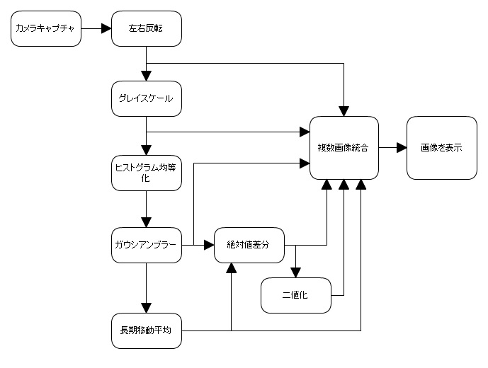
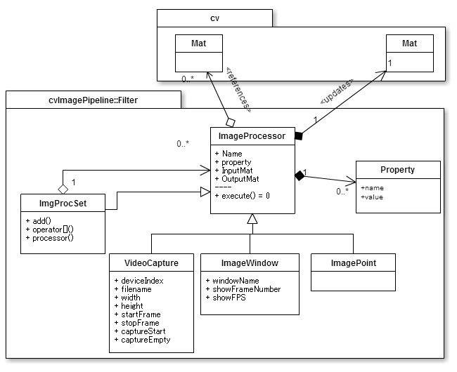

# cvImagePipeline - OpenCV画像処理フィルタシーケンスライブラリ。

## 概要

__[cvImagePipeline](https://github.com/takamin/cvImagePipeline)
はOpenCVを利用した、C++向けのライブラリ__です。

__複数の画像処理ルーチンの入出力画像を接続して、
一連の画像処理の流れをつくる__機能を提供します。



C++で試行錯誤を繰り返しながら、画像処理を記述する場合に、
その処理順序や内容の組み替え時の手間を、
なるべく少なくするために作成しました。

### 通常の画像処理ルーチンにありがちな問題

#### 一般的モデルのコーディングスタイル

一般的な画像処理ルーチンは、多くの場合、その入力から出力までの間で
、複数の画像処理関数を順次呼び出しています。

個々の画像処理関数には、入力画像と処理内容に関するパラメータが渡され、
そして処理結果としての画像が出力され、
さらにこれが次の処理への入力画像として利用されるのです。

#### 試行錯誤と煩雑さ

しかし、多くのプロジェクトの初期段階では、この処理順は確立されておらず、
完成までの間に、処理順序の入れ替えや、処理の追加・削除、
そしてパラメータの変更など、試行錯誤が繰り返されることになります。

これら試行錯誤を繰り返すと、個々の処理と処理の間で、
一時的な出力画像を保持するために、コードが煩雑になります。

### 画像処理プロセッサ - パッケージ化された画像処理ルーチン

このライブラリでは、個々の画像処理ルーチンを、
__画像処理プロセッサ__というクラスにパッケージ化し、
一連の画像処理の流れを、
__個々のプロセッサの出力を他のプロセッサの入力へ接続する__ということで実現します。
これにより、__簡単に画像処理の順序を入れ替えたり、バイパスできる__ようになるのです。

#### 出力から入力への接続接続

画像処理プロセッサは、入力画像（OpenCVのcv::Mat）に処理を加えて、画像を出力します。

この出力を、他の画像処理プロセッサの入力画像へ接続し、一連の画像処理の流れを形成します。
（自分自身の入力ポートへ接続 ― フィードバックすることも可能）
この接続は、実行時に動的に変更可能です。

#### 拡張性

画像処理プロセッサは、単一の抽象クラスとして定義されているため、
新たなプロセッサが必要になれば、これを実装して、
具体的な独自の画像処理プロセッサを作成できます。

#### 基本的なプロセッサ

カメラから画像をキャプチャするもの、画像を表示するウィンドウなど、基本的、汎用的に使用できる画像処理プロセッサを実装しています。（[⇒基本プロセッサ](#processor)）。



#### 階層化・モジュール化

複数の画像処理プロセッサを、ひとつの画像処理プロセッサとして扱えます。

#### XMLファイルからの入力

接続は動的に行え、プロセッサの多くは、実行時にクラス名による生成をサポートしているため、
プロセッサの構成を[XMLファイル](https://github.com/takamin/cvImageBlock/blob/master/sample/sample.xml)に記述できます。
詳細は[サンプルプログラム](#sample)を参照してください。

## <a name="sample"></a>XMLによる画像処理サンプル

XMLを読み込んでカメラ画像を表示する[サンプルプログラム](https://github.com/takamin/cvImageBlock/blob/master/sample/capture.cpp)です。

### 実行方法

コマンドラインから画像処理プロセッサを定義したXMLファイルを指定して実行します。

`$ sample sample.xml[enter]`

XMLファイルの中身については、以下のサンプルXMLを参考にしてください。

### サンプルXML

以下に、カメラでキャプチャした画像に対して、順次処理を行い、途中段階の画像など6つを、ひとつのウィンドウにまとめて表示するXMLファイルの例を示しています。

#### 実行中画面


##### 表示内容

各画像は以下の画像（左上から右下へZ字状に）

1. キャプチャ画像
2. 1をグレイスケールに変換
3. 2に対して、ヒストグラム均一化とガウシアンブラーを適用
4. 3の過去18000フレーム分を平均
5. 3と4の差分
6. 5の二値化

### XMLファイルの中身（[`sample.xml`](https://github.com/takamin/cvImageBlock/blob/master/sample/sample.xml)）

```
<cvImagePipeline name="testProcessor">
  <Processor class="VideoCapture" name="cap">
    <Property name="deviceIndex" value="0"/>
  </Processor>
  <Processor class="Flipper" name="fripHoriz">
    <Property name="flipDir" value="1"/>
  </Processor>
  <Processor class="ImagePoint" name="raw"/>
  <Processor class="ColorConverter" name="grayscale"/>
  <Processor class="EqualizeHist" name="equalizeHist"/>
  <Processor class="GaussianBlur" name="blur"/>
  <Processor class="DepthTo32F" name="depth32F"/>
  <Processor class="ImagePoint" name="pp"/>
  <Processor class="RunningAvg" name="background"> 
    <Property name="averageCount" value="18000"/>
  </Processor>
  <Processor class="AbsDiff" name="diff" autoBind="false">
    <Input to="src1" from="pp"/>
    <Input to="src2" from="background"/>
  </Processor>
  <Processor class="Convert" name="to8UC">
    <Property name="rtype" value="0"/>
    <Property name="alpha" value="255"/>
    <Property name="beta" value="0"/>
  </Processor>
  <Processor class="Threshold" name="binary">
    <Property name="type" value="CV_THRESH_BINARY"/>
    	<!--
	CV_THRESH_BINARY
	CV_THRESH_BINARY_INV
	CV_THRESH_TRUNC
	CV_THRESH_TOZERO
	CV_THRESH_TOZERO_INV
	-->
    <Property name="otsu" value="1"/>
    <Property name="thresh" value="50"/>
    <Property name="maxval" value="255"/>
  </Processor>

  <Processor class="FitInGrid" name="integratedImage" autoBind="false">
    <Property name="width" value="960"/>
    <Property name="height" value="480"/>
    <Property name="cols" value="3"/>
    <Property name="rows" value="2"/>
    <Property name="interleave" value="0"/>
    <Input to="0" from="raw"/>
    <Input to="1" from="grayscale"/>
    <Input to="2" from="blur"/>
    <Input to="3" from="background"/>
    <Input to="4" from="diff"/>
    <Input to="5" from="binary"/>
  </Processor>
  <Processor class="ImageWindow" name="window">
    <Property name="windowName" value="cvImagePipeline"/>
    <Property name="showFPS" value="1"/>
  </Processor>
</cvImagePipeline>
```

#### 簡単な説明

* ルートエレメントは、cvImagePipelineです。
* 画像処理プロセッサはProcessorタグの属性にクラス名と名前を記述して指定します。
* 入出力はautoBind属性が`false`に設定されていない限り、上から順につながります。
* `autoBind=false`の場合や、複数の入力を持つプロセッサは、子要素のInput要素で、他のプロセッサを参照して接続を行います。


## ビルド

cmakeを使用してください。Windows 7(32bit)Visual Studio 2010、Ubuntu 14.04 LTS で動作を確認しています。
OpenCV 2.4が必要です。[DOWNLOADS|OpenCV](http://opencv.org/downloads.html)からダウンロードできます。

__Windowsの場合のビルド例__
```
mkdir build
cd build
cmake -D OpenCV_DIR='path/to/opencv' -D CMAKE_INSTALL_PREFIX='C:/cvImagePipeline' ..
```

## 詳細

### <a name="processors"></a>基本プロセッサ

以下のプロセッサが基本プロセッサです。

|クラス				|概要															|
|:---				|:--															|
| ImageProcessor ([h](include/ImageProcessor.h),[cpp](source/ImageProcessor.cpp))    | 画像処理プロセッサの基本クラスです。複数の入力画像、ひとつの出力画像、複数の型付けされたプロパティを提供します。                          |
| VideoCapture ([h](include/VideoCapture.h),[cpp](source/VideoCapture.cpp))		| カメラまたは動画ファイルのキャプチャ(==`cv::VideoCapture`)	|
| ImageWindow ([h](include/ImageWindow.h),[cpp](source/ImageWindow.cpp))		| 画面表示(== `imshow`)	|
| FitInGrid ([h](include/FitInGrid.h),[cpp](source/FitInGrid.cpp))			| 複数の画像をパネル状に並べて1枚にまとめるプロセッサ。	|
| ImgProcSet ([h](include/ImgProcSet.h),[cpp](source/ImgProcSet.cpp))		| 任意の画像処理プロセッサで構成可能な汎用の画像処理プロセッサ。	|
| ImagePoint ([h](include/ImagePoint.h),[cpp](source/ImagePoint.cpp))		| 無処理(== `cv::copyTo`)。入力画像をそのまま出力します。画像の取り出しポイントとして利用可能。	|

### その他のプロセッサ。

以下のクラスは、サンプル的に実装した単純な画像処理を行うプロセッサです。新たなプロセッサを作成するときなどにも参考にしてください。

|クラス			|概要															|
|:---				|:--															|
| Convert ([h](include/Convert.h),[cpp](source/Convert.cpp)) | フォーマット変換(== `cv::Mat::convertTo`)	| 
| ColorConverter ([h](include/ColorConverter.h),[cpp](source/ColorConverter.cpp))	| チャンネル数変換(== `cv::cvtColor`)	|
| EqualizeHist ([h](include/EqualizeHist.h),[cpp](source/EqualizeHist.cpp))		| ヒストグラム平坦化(== `cv::equalizeHist`)	|
| GaussianBlur ([h](include/GaussianBlur.h),[cpp](source/GaussianBlur.cpp))		| ガウシアン平滑化(== `cv::GaussianBlur`)	|
| Flipper ([h](include/Flipper.h),[cpp](source/Flipper.cpp))			| 反転。(== `cv::flip`)	|
| Resizer ([h](include/Resizer.h),[cpp](source/Resizer.cpp))			| リサイズ(== `cv::resize`)	|
| RunningAvg ([h](include/RunningAvg.h),[cpp](source/RunningAvg.cpp))		| 長期平均(== `cv::runningAvg`)	|
| AbsDiff ([h](include/AbsDiff.h),[cpp](source/AbsDiff.cpp))			| 絶対値差分(== `cv::absdiff`)	|
| SubMat ([h](include/SubMat.h),[cpp](source/SubMat.cpp))			| 差分(== `cv::sub`)	|
| Threshold ([h](include/Threshold.h),[cpp](source/Threshold.cpp))			| 2値化(== `cv::threshold`)	|
| Dilate ([h](include/Dilate.h),[cpp](source/Dilate.cpp))			| 画像の膨張(== `cv::dilate`)	|

### クラス名による実行時の動的インスタンス生成について

クラス宣言で`DECLARE_CVFILTER`、定義時に`IMPLEMENT_CVFILTER` マクロを使用すれば、クラスの名前でインスタンスを生成できます。
動的生成に対応していない場合は、XMLファイルからの構築はできません。

